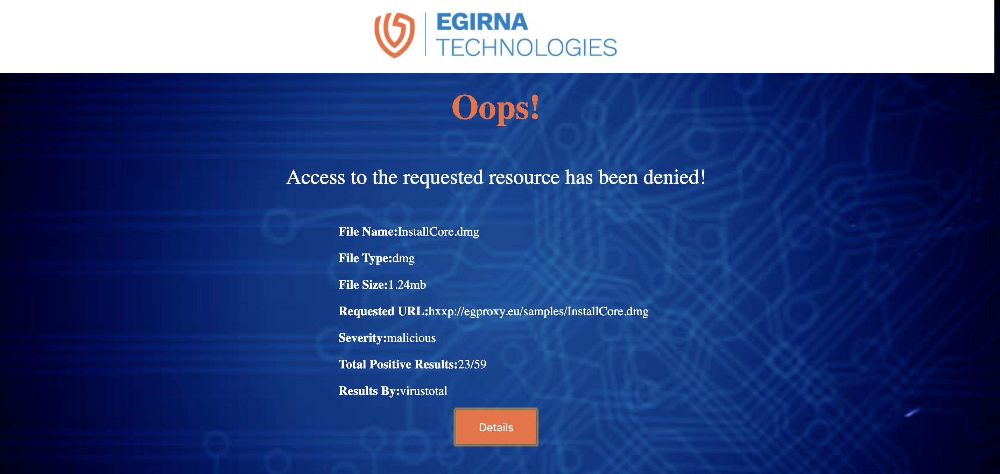

# ICAPeg

Open Source multi-vendor ICAP server

Scan files requested via a proxy server using ICAPeg ICAP server, ICAPeg is an ICAP server connecting web proxies with API based scanning services and more soon!. ICAPeg currently uses [VirusTotal](https://www.virustotal.com/gui/home/upload) for scanning the files following the ICAP protocol. If you don't know about the ICAP protocol, here is a bit about it:

## What is ICAP?

**ICAP** stands for **Internet Content Adaptation Protocol**. If a **content** (for example: file) you've requested over the internet
to download or whatever, needs **adaptation**(some kind of modification or analysis), the proxy server sends the content to the ICAP server for adaptation and after performing the required tasks on the content, the ICAP server sends it back to the proxy server so that it may return the adapted content back to the destination. This can occur both during request and response.

To know more about the ICAP protocol, [check this out](https://tools.ietf.org/html/rfc3507).

## Things to have

Before starting to play with ICAPeg, make sure you have the following things in your machine:

1. **Golang**(latest enough to be able to use go mod)

  ***A sample installation of go version 1.14***:

Prepare the apt packages    
  ```bash
    sudo apt update

  ```
        
  ```bash
    sudo apt upgrade
    
    ```
        
Link of download of version 1.14
    https://dl.google.com/go/go1.14.linux-amd64.tar.gz

Use the command
  ```bash
    wget https://dl.google.com/go/go1.14.linux-amd64.tar.gz

  ```
untar in /usr/local
  ```bash
    tar -C /usr/local -xzf go1.14.linux-amd64.tar.gz
    ```
        
Add /usr/local/go/bin to the PATH environment variable:
    
  ```bash
    export PATH=$PATH:/usr/local/go/bin

  ```
Note: this command adds the PATH temporarily to the environment variables, the path is removed if SSH is broken, or system reboots.


2. A **proxy** server

squid is an example in this readme

3. And a **VirusTotal api key**. [Here is how you can get it](VIRUSTOTALAPI.md)

**NOTE**: All the settings of ICAPeg is present in the **config.toml** file in the repo, including where you should put your VirusTotal api key.

## How do I turn this thing on!!

To turn on the ICAPeg server, proceed with the following steps (assuming you have golang installed in you system):

1. Clone the ICAPeg repository

```git clone https://github.com/egirna/icapeg.git```


2. Enable `go mod`

  ```bash
    export GO114MODULE=on

  ```
  In case not using go version 1.14, you could discover your version
  ``` go version```

2. Add the dependencies in the vendor file

  ```bash
   go mod vendor
  ```

3. Build the ICAPeg binary by

  ```bash
    go build .
  ```

4. Finally execute the file like you would for any other executable according to your OS, for Unix-based users though

  ```bash
    ./icapeg
  ```

   You should see something like, ```ICAP server is running on localhost:1344 ...```. This tells you the ICAP server is up and running
OR, you can do none of the above and simply execute the **run.sh** shell file provided, by

  ```bash
  ./run.sh
  ```
That should do the trick.

1. Now that the server is up and running the next thing to do is setup a proxy server which can send the request body to the ICAPeg server for adaptation. [Squid](http://www.squid-cache.org/) looks like just the thing for the job, go to the site provided and set it up like you want. Here is a sample conf file for squid:

  ```configuration
    icap_enable on
    icap_service service_resp respmod_precache icap://127.0.0.1:1344/respmod-icapeg
    adaptation_access service_resp allow all
    http_port 3128
    cache deny all
  ```

1. Now that you have squid running as well, you can test it out by trying to download/access a file from the internet(through the proxy) and see the magic happen! You'll be able to download/access the file if its alright, but something like a malicious file, you are gonna see something like this:


Oh, and do not forget to setup your Browser or Machine 's  proxy settings according to the squid.

## How do i know its working!

So once you have everything up and running, keep an eye out for the logs on the terminal where the ICAP server is running. If you try and download something not malicious you should see something like this in the logs:

Likewise if what you are downloading is malicious, apart from the error page, there will be terminal logs such as:
.

To test properly using malicious files , visit the [Eicar Test File Site](https://www.eicar.org/?page_id=3950), and try to download a malicious file, check the logs. If you are still not getting any logs whatsoever, please check your proxy(squid) setup.

## Things to keep in mind

1. You will have to restart the ICAP server each time you change anything in the config file.

1. You need to configure your network(or your browser)'s proxy settings to go through squid


### Contributing

This project is still a WIP. So you can contribute as well. See the contributions guide [here](CONTRIBUTING.md).

### License

ICAPeg is licensed under the [Apache License 2.0](LICENSE).
