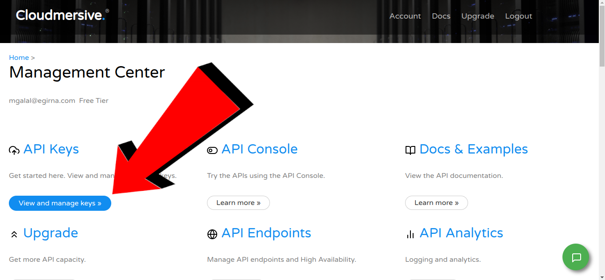

# Steps to get a public **CloudMersive** api key

1. Sign up with **Cloudmersive** from [here](https://account.cloudmersive.com/signup)

1. As soon as you do that, an email will be sent to the address you've provided during sign up with the confirmation link.

1. You may need to sign in to your **Cloudmersive** account with the newly signed up credentials.

1. Click at **view and manage keys**.

   

1. Copy your **PUBLIC API KEY**.

   

1. Paste it as a value of **api_key** variable in **Cloudmersive** section.

1. 
