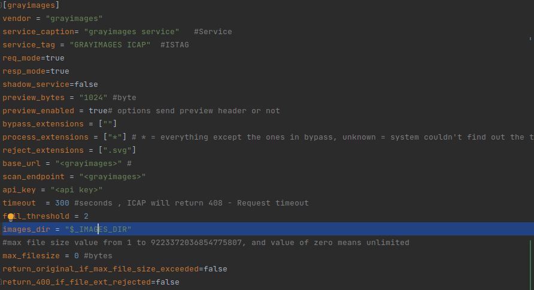

# Steps to use grayimages service 

## 1. Install GCC compiler
#### Linux:
Update the apt package
```bash
sudo apt update
```
Install build-essential package 
```bash
sudo apt install build-essential
```
Verify installation
```bash
gcc --version
```
## 2. Install libwebp
#### Linux:
```bash
sudo apt-get update
sudo apt-get install libwebp-dev
```

## 3. Specify a directory path in [config.toml](https://github.com/egirna/icapeg/blob/develop/config.toml) for gray images besides the rest of variables
This path is used to temporarily save gray images. After sending the image back in a response, file is deleted.


## 4. Build the ICAP
Build **ICAPeg** binary

```bash
go build .
```

Execute the file like you would for any other executable according to your OS, for Unix-based users though

```bash
./icapeg
```